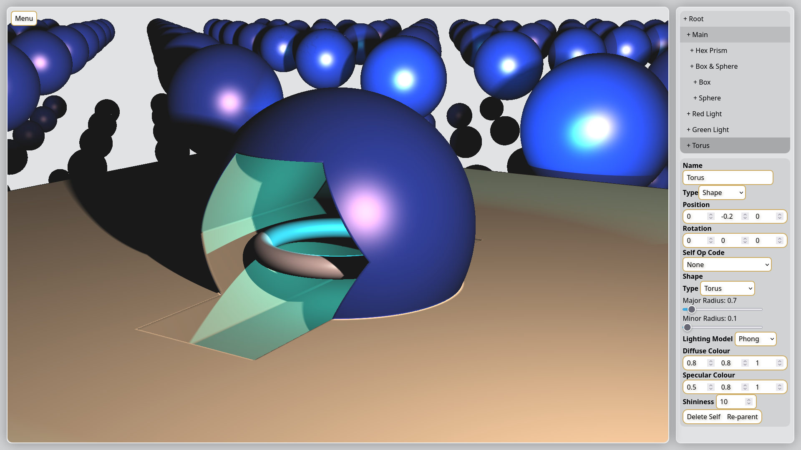

# Web SDF
An online editor and toy for raymarched SDF (Signed Distance Function) scenes.

[Online Version](http://alanlawrey.me/web-sdf/)

Supports several different builtin shapes and common SDF operations.

The most recent version compiles the current scene tree into GLSL code, which does add a compilation step when the scene changes, but it also means that it's quite fast. For common values such as shape parameters, shape locations and rotation, material values, and light values, those values are updated via shader uniforms which avoids the need to recompile. The scene only recompiles when the scene tree changes.

This is largely a toy and learning exercise! Whilst there is some ability to save and load the current scene, I'm not intending this to be anything close to a production ready tool.

## References
- SDF 3D functions by [Inigo Quilez](https://iquilezles.org/articles/distfunctions/)
- Additional SDF 3D functions by [Michael Fogleman](https://github.com/fogleman/sdf/blob/d58a6fc63b75fc1cf1ebb71e0b42bf552319c8f1/sdf/d3.py#L314)

## Author
Alan Lawrey 2025